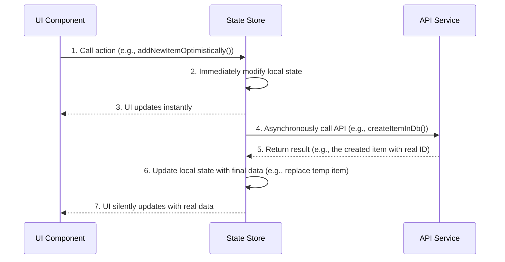

# Professional Optimistic UI & State Management Guide

_Last Updated: August 02, 2025_

## 1. Core Principle: UI Must Be Instantaneous

**CRITICAL**: All UI interactions that involve data mutation (Create, Update, Delete) **MUST** be implemented using an **optimistic update** pattern. The user interface must respond instantly, without waiting for a network request to complete. Pessimistic updates (waiting for the server before showing the change) are strictly forbidden for UI-facing operations as they create a sluggish and unprofessional user experience.

## 2. Architectural Pattern

The standard pattern involves three distinct layers of responsibility: the **UI Component**, the **State Store**, and the **API Service**.



## 3. Implementation Example: Creating a New Item

This pattern demonstrates how to correctly implement an optimistic creation flow.

### 3.1. State Store (`/src/lib/stores/`)

The store is the heart of the operation. It must separate the optimistic UI action from the background database action.

```typescript
// In your store, e.g., itemManagerStore.svelte.ts

/**
 * 1. UI-Facing Action: Handles only the optimistic update.
 */
function addNewItemOptimistically() {
	// Create a temporary item with a client-side unique ID
	const tempId = `optimistic-${crypto.randomUUID()}`;
	const newItem = {
		id: tempId,
		name: 'New Item'
		// ... other default properties
	};

	// Immediately add the temporary item to the local state array
	itemState.items = [...itemState.items, newItem];

	// Trigger the background database operation, but do not wait for it
	createItemInDb(newItem);
}

/**
 * 2. Background DB Action: Handles the API call and final state update.
 */
async function createItemInDb(tempItem: Item) {
	try {
		// The API payload should not contain the temporary ID
		const { id, ...createData } = tempItem;

		const response = await fetch('/api/items/create', {
			method: 'POST',
			body: JSON.stringify({ data: createData })
		});

		const result = await response.json();
		if (!result.success) {
			throw new Error(result.message);
		}

		const realItem = result.data as Item;

		// 3. Final State Update: Replace the temporary item with the real one from the DB
		itemState.items = itemState.items.map((item) => (item.id === tempItem.id ? realItem : item));
	} catch (error) {
		// 4. Revert on Failure: If the API call fails, remove the temporary item
		itemState.items = itemState.items.filter((item) => item.id !== tempItem.id);
		// Notify the user via a feedback store or UI state change
	}
}
```

### 3.2. API Endpoint (`/src/routes/api/`)

The API endpoint must return the full, newly created object to allow the store to update its state accurately.

```typescript
// In /src/routes/api/items/create/+server.ts

export const POST: RequestHandler = async ({ request }) => {
	const { data } = await request.json();

	// The service creates the item in the database
	const newItem = await itemService.createItem(data);

	// CRITICAL: Return the full created object
	return json({ success: true, data: newItem });
};
```

### 3.3 Pattern: API-backed Smart Store lists (stores own the truth)

For feature domains that follow the Smart Store pattern with server-backed lists:

- The Smart Store owns both the **optimistic mutation** and the **list reconciliation**.
- The typical flow is:
  1. UI calls a store method (e.g., `createWarehouseOptimistically`, `updateRouteOptimistically`, `submitBidOptimistically`).
  2. The store applies an optimistic update to its local state (e.g., updates the relevant item in `warehouses`, `routes`, `bids`, `assignments`).
  3. The store triggers a background HTTP call to a SvelteKit API route.
  4. On success:
     - For single‑item updates where the local optimistic state is sufficient, the store **does not** need to re‑read the item from the server.
     - For structural changes or creations that affect the overall list (e.g., new class, imported batch), the store may call a `refreshData()`/`load...()` helper that re‑loads the list from the API.
  5. On failure, the store reverts the optimistic change and surfaces an error via its own `error` state or a feedback store (e.g., `toastStore`).

This pattern is implemented in Drive stores such as:

- `src/lib/stores/warehouseStore.svelte.ts`
- `src/lib/stores/routeStore.svelte.ts`
- `src/lib/stores/bidsStore.svelte.ts`
- `src/lib/stores/scheduleStore.svelte.ts`

## 4. Validation Checklist

- [ ] **UI is Instant:** All create, update, and delete actions update the UI immediately.
- [ ] **No `await` in UI-Facing Actions:** The function called directly by the UI (`addNewItemOptimistically`) must not `await` the database operation.
- [ ] **State is Reverted on Failure:** The `catch` block in the background function correctly reverts the optimistic change if the API call fails.
- [ ] **API Returns Full Object:** For `create` operations, the API returns the complete object, including its server-generated ID and timestamps.

- [ ] **State parity for ordering timestamps:** When an optimistic timestamp affects sort order, include the same timestamp in the update payload so the eventual server-backed state matches the optimistic state and avoids reorder/flicker.
- [ ] **Single reconciliation source:** When multiple feeds exist (e.g., HTTP responses plus a background refresh), the Smart Store remains the single source of truth.

## 5. Operational Requirements

- **User Feedback:** Use `toastStore` for server failures and clear inline errors for validation failures.
- **Structured Logging:** On the server, use `src/lib/server/logger.ts` (Pino) with contextual fields. Do not log secrets/PII.
- **Filter‑dependent semantics:** When list actions vary by filter (e.g., archiving hides immediately under `status=active` but toggles status under `status=all`), add unit tests that cover both behaviors.
